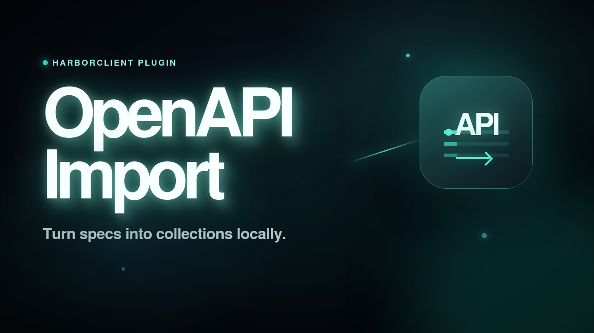

# OpenAPI Import

HarborClient plugin that imports an OpenAPI 3.x specification and creates a collection with requests grouped by the first tag on each operation.



## Features

- **File → Import** integration for OpenAPI JSON/YAML specs
- Local JSON/YAML parsing — nothing is uploaded
- Preview operations grouped by tag before import
- Bulk collection creation via `hc.host.createCollection`

## Permissions

- `ui` — main view, File -> Import handler, and host collection command
- `storage` — hand off the imported spec from the agent webview to the preview webview

## Setup

```bash
pnpm install
pnpm build
```

Load the project folder in HarborClient via **Settings → Plugins → Load unpacked…**.

Requires `@harborclient/sdk@^0.4.3`.

## Local SDK development

Do not commit `file:` paths in `package.json`. To test against a local `@harborclient/sdk` checkout without changing tracked files, use one of:

- `pnpm link` from the published package directory after `pnpm pack` in `harborclient/sdk`
- A gitignored override file that only exists on your machine

## Development

```bash
pnpm dev
```

Rebuilds `dist/renderer.js` on change. Keep the Import OpenAPI main view open for hot reload.

## Usage

1. Choose **File → Import** and select an OpenAPI `.json`, `.yaml`, or `.yml` file.
2. Review the generated operations, adjust the collection name, and deselect any endpoints you do not need.
3. Click **Import collection**.

Requests are grouped into folders using each operation's first OpenAPI tag. Untagged operations are created at the collection root.

## Limitations (v1)

- OpenAPI 3.x only
- No `$ref` resolution beyond inline schemas on request bodies
- Request bodies are inferred from JSON examples or simple object schemas only
